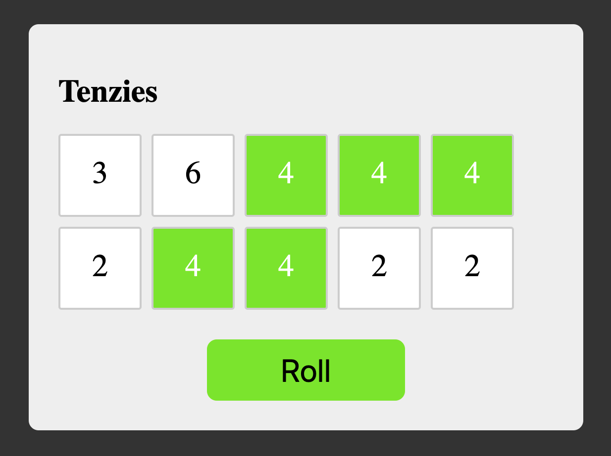

# Tenzi Dice Game (React + Vite)

Tenzi's rules are simple. You have 10 virtual dice and you need to receive the same value onn all of them, rolling them by clicking a roll button again and again. 
You can select one or few dice with desired values by clicking on them. Repeat until you select all dice and all of them have the same value.
After that you can restart game.

You can see how this code works here:
[Tenzie](https://tenzidicegame.netlify.app/)